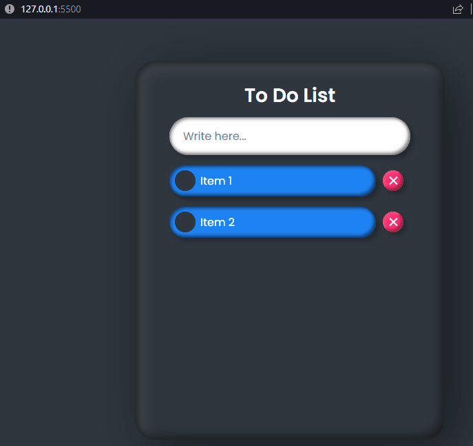

# TODO LIST

## Conteúdo do projeto

- [Sobre](#about)
- [Começando](#getting_started)
- [Referências](#refer)

## Sobre 

Esse projeto demonstra como criar uma ToDo List com HTML, CSS e JavaScritpt.

## Começando 

O projeto usa basicamente a inserção de elementos HTML através do JavaScript utilizando a DOM e utilizando algumas propriedades personalizadas no CSS para manipular a barra lateral do navegador com -webkit-scrollbar, que permite personalizar a sua aparência.

### Pré-requisitos

Não há nenhum componente externo no projeto.

## Referências 

Esse projeto foi extraído de um vídeo do canal Online Tutorials que tem muitos exemplos muito maneiros de contrução de código apenas com HTML, Javascript e CSS.

Link do vídeo: <a href="https://www.youtube.com/watch?v=CsO0UJSqaw0">Online Tutorials</a>